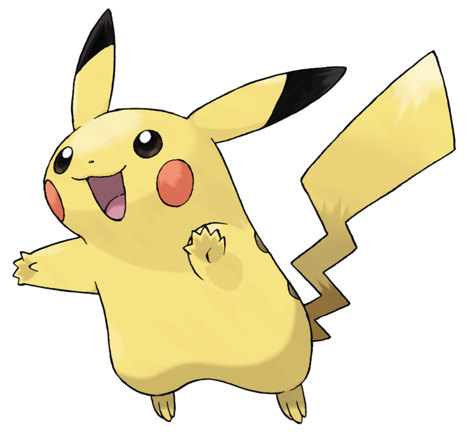

<!-- 1-Encabezados -->

# Cabecera 1
## Cabecera 2
### Cabecera 3

<!-- 2-Formato de texto -->
***
Este texto esta escrito en *cursiva*

Este texto esta escrito en **negrita**

Este texto esta escrito en ~~tachado~~

Este texto esta escrito en <mark>remarcado</mark>

<!-- 3-Listas -->
***

* Desordenada item 1

	* Desordenada item 2
	
* Desordenada item 2

1. Ordenada 1

	1.1. Macarrones
	
2. Ordenada 2

- [ ] Sacar a pasear al perro
- [x] Comprar macarrones

\* Esto es un asterisco

<!-- 4-Enlaces -->
***
[Universidad de Valencia](https://www.uv.es)

[Universidad de Castellon](https://www.uji.es "La UJI")

<!-- 5-Citas -->
***
> Esto es una cita
>> Y esto un subcita
>>> Y ahora vamos a aprender Java:

 

~~~
System.out.println("Hola mundo")
~~~

 

<!-- 6-Tablas -->
***

|Nombre      |Tipo        |Poder    |
|----------- |----------- |-------- |
|Bulbasaur   | Tierra     |154      |
|Pikachu     | Electrico  |189      |
|Bulbasaur   | Fuego      |220      |

<!-- 7-Imagenes -->
***

<!-- 8-Emojis para GitHud -->
***

:smiley:

:sunny:

<!-- 9-INsertar video de Youtube -->
***
